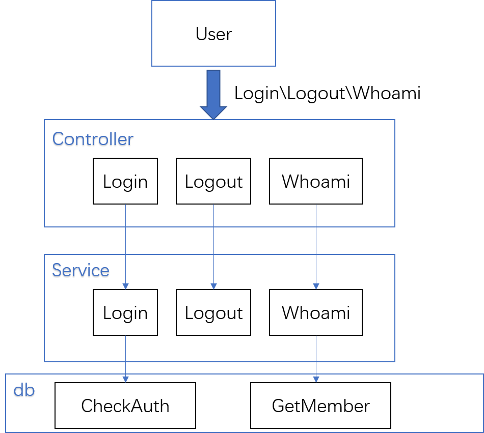

# ByteDance
<style>
table {
margin: auto;
}
</style>
# 项目分工

| 项目模块 | 负责人       |
| -------- | ------------ |
| 登录模块 | 邱港、刘丰利 |
| 成员模块 | 高新想       |
| 排课模块 | 田思润       |
| 抢课模块 | 陈杨         |


# 成员模块

## 成员模块架构：

| 排课模块      | 路由函数                 | 服务层函数                   | 数据库层函数         |
| :------------ | :----------------------- | :--------------------------- | :------------------- |
| CreateMember  | controller.CreateMember  | member_service.CreateMember  | models.CreateMember  |
| GetMember     | controller.GetMember     | member_service.GetMember     | models.GetMember     |
| GetMemberList | controller.GetMemberList | member_service.GetMemberList | models.GetMemberList |
| UpdateMember  | controller.UpdateMember  | member_service.UpdateMember  | models.UpdateMember  |
| DeleteMember  | controller.UnbindCourse  | member_service.DeleteMember  | models.DeleteMembe   |

```go
memberGroup := router.Group("/member")
{
   memberGroup.POST("/create", controller.CreateMember)
   memberGroup.GET("/", controller.GetMember)
   memberGroup.GET("/list", controller.GetMemberList)
   memberGroup.POST("/update", controller.UpdateMember)
   memberGroup.POST("/delete", controller.DeleteMember)
}
```

* ## 创建成员CreateMember

### 实现步骤

1. 检查参数绑定是否正确
2. 检查请求是否携带Cookie
3. 检查用户是否具有创建用户的权限
4. service层判断各种参数是否正确
5. 调用数据库创建用户
6. 返回错误码

* ## 获取成员信息

### 实现步骤

1. 检查参数绑定是否正确
2. 调用数据库接口获取成员信息
3. 返回错误码和成员信息

* ## 批量获取成员信息

### 实现步骤

1. 检查参数绑定是否正确
2. 调用数据库结构批量获取成员信息
3. 返回错误码和成员信息列表

* ## 更新成员信息

### 实现步骤

1. 检查参数绑定是否正确
2. 调用数据库接口更新成员信息
3. 返回错误码

* ## 删除成员信息

### 实现步骤

1. 检查参数绑定是否正确
2. 调用数据库接口删除成员信息
3. 返回错误码

# 登陆模块

## 登录模块架构：




登陆模块 | 路由函数 | 服务层函数 | 数据库层函数
:---:|:---:|:---:|:---:
Login | controller.Login | service.Login | db.CheckAuth
Logout | controller.Logout | |
Whoami | controller.Whoami | service.GetMember | db.GetMember


``` go
g.POST("/auth/login", controller.Login)
g.POST("/auth/logout", controller.Logout)
g.GET("/auth/whoami", controller.Whoami)
```

* ## 登陆Login

### 实现步骤

1. 参数校验
    * Json参数绑定校验，如果与types.LoginRequest绑定失败返回types.ParamInvalid
    ``` go
    var request types.LoginRequest
	if err := c.ShouldBindJSON(&request); err != nil {
		c.JSON(http.StatusBadRequest, types.LoginResponse{
			Code: types.ParamInvalid,
			Data: struct{ UserID string }{UserID: ""},
		})
		return
	}
    ```
    * Username，Password参数长度与大小写校验(采用正则表达式进行校验)，不符合指定要求返回types.ParamInvalid
    ``` go
    func CheckUserName(username string) bool {
	reg, _ := regexp.Compile("^[A-Za-z]{8,20}$")
	return reg.MatchString(username)
    }
    
    func CheckPassword(password string) bool {
	reg, _ := regexp.Compile("^[A-Za-z0-9]{8,20}$")
	return reg.MatchString(password)
    }
    ```
    * 校验成功，进行入库查询
    
2. 入库查询
    * 查询对应Username与Password，并且保证状态为没有被删除，查询失败则返回types.WrongPassword;查询成功获取对应UserId

    ``` go
    var member types.Member
	err := DB.Select("user_id").Where("username = ? AND password = ? AND deleted = ?", username, 
    password, 0).First(&member).Error
    ```

    * 登陆成功，进行Cookie与Session设置
    
3. 设置Cookie、Session
    * 设置Cookie："camp-session"
    * 根据Cookie设置Session
    * Session添加"userId"键值对，便于后续登出与获取个人信息
    * 返回对应UserId
    ``` go
    session := sessions.Default(c)
	session.Set("userId", userId)
    ```

* ## 登出Logout

### 实现步骤
1. Cookie、Session校验
    * 获取Cookie："camp-session"，没有获取到即没有登陆，返回types.LoginRequired
    ``` go
    value, err := c.Cookie("camp-session")
	if err != nil {
		c.JSON(http.StatusOK, types.LogoutResponse{
			Code: types.LoginRequired,
		})
		return
	}
    ```
    * 获取到即为登陆状态，进行删除Cookie
2. 登出删除Cookie、Session
    * 删除清空Session
    * 设置Cookie："camp-session"最大生命周期为-1，达到删除Cookie的目的
    ``` go
    session := sessions.Default(c)
	session.Clear()
    cookie := http.Cookie{
		Name:     "camp-session",
		Value:    value,
		Path:     "/",
		Domain:   "",
		Expires:  time.Time{},
		MaxAge:   -1,
		Secure:   false,
		HttpOnly: false,
	}
	http.SetCookie(c.Writer, &cookie)
    ```

* ## 获取个人信息Whoami

### 实现步骤
1. Cookie、Session校验
    * 获取Cookie："camp-session"，没有获取到即没有登陆，返回types.LoginRequired
    * 获取到即为登陆状态，进行入库查询
    
2. 入库查询
    * 通过session.Get("userId")获取登陆中的userId
    * 通过userId进行入库查询，如果查询失败，将Cookie清空，认为为未登录状态
    ``` go
    err := DB.Where("user_id = ?", userId).First(&member).Error
    ```
    
3. 返回个人信息
    * 将入库查询到的信息返回


# 排课模块

## 排课模块架构：

&nbsp;


|     排课模块     |          路由函数           |        服务层函数        |    数据库层函数     |
| :--------------: | :-------------------------: | :----------------------: | :-----------------: |
|   CreateCourse   |   controller.CreateCourse   |   service.CreateCourse   |   db.CreateCourse   |
|    GetCourse     |    controller.GetCourse     |    service.GetCourse     |    db.GetCourse     |
|  ScheduleCourse  |  controller.ScheduleCourse  |  service.ScheduleCourse  |                     |
|    BindCourse    |    controller.BindCourse    |    service.BindCourse    |    db.BindCourse    |
|   UnbindCourse   |   controller.UnbindCourse   |   service.UnbindCourse   |   db.UnbindCourse   |
| GetTeacherCourse | controller.GetTeacherCourse | service.GetTeacherCourse | db.GetTeacherCourse |

&nbsp;

``` go
courseCroup := router.Group("/course")
	{
		courseCroup.POST("/create", controller.CreateCourse)
		courseCroup.GET("/get", controller.GetCourse)
		courseCroup.POST("/schedule", controller.ScheduleCourse)
	}

	teacherGroup := router.Group("/teacher")
	{
		teacherGroup.POST("/bind_course", controller.BindCourse)
		teacherGroup.POST("/unbind_course", controller.UnbindCourse)
		teacherGroup.GET("/get_course", controller.GetTeacherCourse)
	}
```

* ## 创建课程CreateCourse

### 实现步骤

1. 参数校验

   * Json参数绑定校验，如果与types.CreateCourseRequest绑定失败返回types.ParamInvalid

   ``` go
   var createCourseRequest types.CreateCourseRequest
   if err := r.BindJSON(&createCourseRequest); err != nil {
   	r.JSON(http.StatusBadRequest, types.CreateCourseResponse{
   		Code: e.ParamInvalid,
   		Data: struct{ CourseID string }{CourseID: ""},
   	})
   	return
   }
   ```

   * 校验成功，创建课程

2. 创建课程

   * 在数据库中写入数据

   ``` go
   err := db.Create(course).Error
   ```

* ## 查询课程GetCourse

### 实现步骤

1. 参数校验

   * 检验输入数据是否符合要求

2. 入库查询

   * 通过课程id查询

   ``` go
   var course Course
   err := db.Where("course_id = ?", courseId).First(&course).Error
   ```

3. 检验结果是否合法

   * 课程是否存在
   * 是否已被删除

* ## 排课ScheduleCourse

### 实现步骤

1. 参数校验

   * 检验参数是否合法

2. 运算求解

   * 用前向星建立二分图

   ``` go
   func add(x string, y string) {
       cnt++
       a[cnt].to = y
       a[cnt].next = head[x]
       head[x] = cnt
   
   }
   ```

   * 匈牙利算法求解

   ``` go
   func dfs(u string, time int) bool {
       var i int
       for i = head[u]; i != 0; i = a[i].next {
           v := a[i].to
           if vis[v]^time != 0 {
               vis[v] = time
               if (f[v] == "") || dfs(f[v], time) {
                   f[v] = u
                   ans[u] = v
                   return true
               }
           }
       }
       return false
   }
   ```

3. 返回结果

   * 将计算结果返回

* ## 绑定课程BindCourse

  实现步骤：

1. 参数检验

   * 检验参数是否合法

2. 数据检验

   * 查看该课程是否存在

   ``` go
   var course Course
   err := db.Where("course_id = ? AND deleted = ?", courseId, 0).First(&course).Error
   ```

   * 若该课程不存在返回ErrRecordNotFound

3. 数据修改

   * 将课程与教师绑定

   ``` go
   db = db.Model(&course).
   	Where("course_id = ? AND teacher_id = ? AND deleted = ?", courseId, "", 0).
   	Update("teacher_id", teacherId)
   ```

* ## 解绑课程UnbindCourse

实现步骤：

1. 参数检验

   * 检验参数是否合法

2. 数据检验

   * 查看该课程是否存在

   ``` go
   var course Course
   err := db.Where("course_id = ? AND deleted = ?", courseId, 0).First(&course).Error
   ```

   * 若该课程不存在返回ErrRecordNotFound

3. 数据修改

   * 将课程与教师绑定

   ``` go
   db = db.Model(&course).
   	Where("course_id = ? AND teacher_id = ? AND deleted = ?", courseId, teacherId, 0).
   	Update("teacher_id", "")
   ```

* ## 查询老师课程GetTeacherCourse

  实现步骤：

1. 参数检验

   * 检验参数是否合法

2. 入库查询

   ``` go
   var courseList []*types.TCourse
   err := db.Where("teacher_id = ? AND deleted = ?", teacherId, 0).Find(&courseList).Error
   ```


# 抢课模块

## 抢课模块架构

&nbsp;


|     排课模块     |          路由函数           |        服务层函数        |            数据库层函数             |
| :--------------: | :-------------------------: | :----------------------: | :---------------------------------: |
|    BookCourse    |    controller.BookCourse    |    service.BookCourse    | db.BookCourse，db.BookCourseInRedis |
| GetStudentCourse | controller.GetStudentCourse | service.GetStudentCourse |         db.GetStudentCourse         |

&nbsp;

### 实现步骤

1. 首先从redis中查询是否存在抢课的课程，如果没有，返回课程不存在
2. 从redis中判断用户是否已经抢过课程，如果已经抢过，返回课程不可获取
3. 从redis中判断课程是否还有剩余，如果没有直接返回课程不可获取
4. 然后使用redis原子减法减去课程对应的容量，如果减完之后的返回值小于0，返回课程不可获取
5. 向redis中存入学生的抢课信息
6. 向channel中添加课程的抢课信息
7. 另一个协程获取channel中的信息并异步存入MySQL中
8. 返回抢课成功